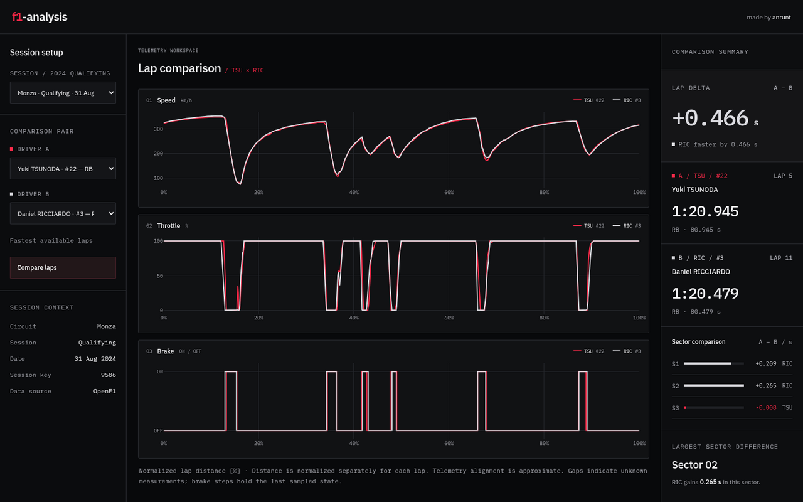
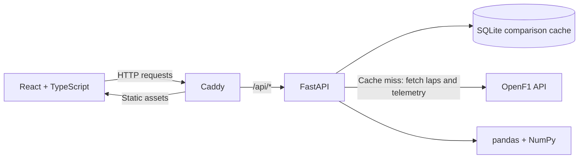

# F1 Analysis

A full-stack Formula 1 telemetry analysis application for comparing drivers' fastest qualifying laps using OpenF1 data.

**[Live demo](https://f1-analysis.duckdns.org/)** · [Telemetry processing](#telemetry-processing) · [Run locally](#running-locally)



*Yuki Tsunoda vs Daniel Ricciardo — Monza, 2024 qualifying. Select the session and drivers in the demo to explore the comparison.*

## Tech stack

| Layer | Technologies |
| --- | --- |
| Backend & data processing | Python, FastAPI, pandas, NumPy, Pydantic, HTTPX |
| Frontend & visualisation | React, TypeScript, Vite, Plotly, Tailwind CSS, Zod |
| Data & caching | OpenF1 API, SQLite |
| Infrastructure | Docker, Docker Compose, Caddy, GitHub Actions, GHCR |

## What it does

- Select a 2024 qualifying session and compare two drivers' fastest available laps.
- Explore speed, throttle, braking, gear and RPM traces with interactive hover and zoom on a shared relative-distance axis.
- Compare lap times and sector deltas, including the sector with the largest time difference.
- Process timestamped telemetry into a common **1001-point grid** using channel-specific resampling.
- Cache processed comparisons in SQLite for one hour, with storage persisted across container replacements.
- Validate upstream data with Pydantic and API responses with Zod; display loading, error and missing-telemetry states.

## Architecture



Caddy serves the built frontend and proxies `/api/*` requests to FastAPI, keeping the application on a single origin. The backend selects laps, fetches telemetry and performs all numerical processing; React renders the resulting comparison with Plotly.

The cache stores validated comparison results by session and ordered driver pair. Expired entries are ignored on reads and cleaned up at application startup. The database lives in the external `f1-cache` Docker volume.

## Telemetry processing

Different laps contain samples recorded at different timestamps. Comparing them requires a common reference axis. The pipeline in [`backend/main.py`](backend/main.py) works as follows:

1. **Select laps.** Choose each driver's shortest positive lap duration, excluding pit-out laps, and fetch car data within that lap's time window.
2. **Estimate distance.** Sort samples by timestamp, convert speed from km/h to m/s, and integrate speed over time using the trapezoidal rule: `Δs = (v_previous + v_current) / 2 × Δt`.
3. **Normalise.** Divide cumulative distance by each lap's total estimated sampled distance, producing a relative-distance axis from `0` to `1`.
4. **Resample.** Map both laps onto `np.linspace(0, 1, 1001)`. Speed, throttle and RPM use linear interpolation. RPM accepts finite, non-negative values without a fixed upper limit; zero is a valid measurement. Brake and gear use the last sampled state at or before each grid point, preserving their discrete values. Gear accepts values from `0` to `8`, with `0` displayed as `N` (neutral / no gear engaged).
5. **Preserve unknowns.** Invalid or missing throttle, brake, gear and RPM values become `null` in the response and gaps in the charts. Brake and gear hold each sampled state only until the next sample; missing measurements are not filled with the last known value. Entirely unavailable telemetry channels are identified in the UI.

Lap and sector deltas come from **OpenF1's reported timing values**, independently of the resampled traces. All deltas use **A − B**: a negative value means driver A was faster.

## CI/CD & deployment

The [GitHub Actions workflow](.github/workflows/ci.yml) runs on pushes and pull requests:

1. Install frontend dependencies, run Oxlint, then type-check and build with TypeScript and Vite.
2. Validate Docker Compose, build both images and start the services with readiness checks.
3. Check `/api/health` through Caddy to verify the proxy-to-backend path.

Pushes to `master` also publish the checked images to GHCR and deploy them to a VPS over SSH:

```text
Push to master → Lint & build → Container startup & health checks
    → GHCR → Deploy by SHA-256 image digest → Production HTTPS check
        ├─ Pass: keep the release
        └─ Fail after activation: restore and recheck the previous release
```

The [deployment script](scripts/deploy.sh) accepts only the expected image repositories with SHA-256 digests, locks against concurrent deployments, and backs up the active configuration before switching releases. It verifies both HTTP 200 and `{"status":"ok"}` over production HTTPS. If activation or verification fails, it automatically attempts to restore the previous images and checks their health again; a failed rollback is reported explicitly.

Caddy handles HTTPS in production. Both application images run as non-root users, and the production backend is accessible through the internal Compose network.

## Running locally

**Prerequisites:** Git and Docker with the Compose plugin. The application needs network access to OpenF1.

```bash
git clone https://github.com/anrunt/f1-analysis.git
cd f1-analysis
docker volume create f1-cache
docker compose up --build --wait
```

| Service | Local URL |
| --- | --- |
| Application | http://localhost:8080 |
| API health through Caddy | http://localhost:8080/api/health |
| FastAPI interactive documentation | http://localhost:9000/docs |

No environment file is needed for this local setup. Open the application, select a session and two drivers, then choose **Compare laps**. A first comparison takes longer because it fetches data from OpenF1; repeated requests for the same pair can use the cache.

Stop the services with `docker compose down`. The external cache volume is retained.

## Limitations & design decisions

- **Approximate alignment.** Distance is estimated from speed, not GPS, and normalised separately for each lap. The axis spans the available samples, which may not cover the exact start and finish. Matching percentages are approximate positions, not guaranteed matches to the same point on track.
- **Interpolation does not add measurement detail.** The 1001-point grid provides a consistent comparison axis; it does not increase the resolution of the source telemetry. Brake is an on/off state, not brake pressure.
- **Session-wide fastest laps.** The UI currently exposes 2024 qualifying sessions. Lap selection does not restrict comparisons to the same qualifying segment or account for tyre choice, fuel load, weather or track evolution.
- **Upstream dependency.** Data availability depends on OpenF1. Requests use timeouts and map upstream failures to API errors, but there is no automatic retry/backoff. Missing channels can still leave lap and sector timing available.
- **Health-check scope.** Deployment checks verify application availability and routing; they do not validate telemetry accuracy or OpenF1 availability.

Telemetry and timing data are provided by [OpenF1](https://openf1.org/).
